# WireGuard VPN Server (Proxmox Homelab)

## Overview
This repository documents the attempted deployment of a WireGuard VPN server within a Proxmox-based homelab using a Debian virtual machine. The goal was to create a secure tunnel for remote access to internal services such as NAS. While the configuration was completed successfully and the mobile peer sent packets, the VPN tunnel failed due to limitations imposed by Carrier-Grade NAT (CGNAT). No handshake occurred on the server. The project was shelved, and future remote access efforts have been redirected to Tailscale.

## Key Skills Demonstrated
- Proxmox virtual machine deployment and Debian server setup  
- WireGuard VPN installation and peer provisioning  
- Public/private key pair generation  
- Static tunnel IP addressing (10.10.10.0/24)  
- System service enablement and debugging with `wg`, `systemctl`  
- PersistentKeepalive configuration and DNS fallback for roaming clients  
- QR code provisioning for mobile clients  
- IP forwarding and iptables NAT configuration  
- WAN IP and port reachability testing using external tools  
- Detection and confirmation of CGNAT issues with supporting screenshots  

---

## Setup Details

### 1. Environment and Network Layout
- **Proxmox Host IP**: `192.168.0.10`  
- **Debian VPN Server VM IP**: `192.168.0.201`  
- **Tunnel Subnet**: `10.10.10.0/24`  
- **Server Tunnel IP**: `10.10.10.1`  
- **Client Tunnel IP**: `10.10.10.2`  
- **WireGuard Port**: `51888`  
- **LAN Interface**: `enp6s18`  

### 2. Key Pair Generation
```bash
wg genkey | tee server_private.key | wg pubkey > server_public.key
wg genkey | tee phone_private.key | wg pubkey > phone_public.key
```

### 3. Server Configuration – `/etc/wireguard/wg0.conf`
```ini
[Interface]
Address = 10.10.10.1/24
PrivateKey = <server_private_key>
ListenPort = 51888

[Peer]
PublicKey = <phone_public_key>
AllowedIPs = 10.10.10.2/32
PersistentKeepalive = 25
```

### 4. Mobile Client Configuration
```ini
[Interface]
PrivateKey = <phone_private_key>
Address = 10.10.10.2/24
DNS = 1.1.1.1

[Peer]
PublicKey = <server_public_key>
AllowedIPs = 0.0.0.0/0
Endpoint = <public_ip>:51888
PersistentKeepalive = 25
```

### 5. Service Enablement
```bash
sudo systemctl enable wg-quick@wg0
sudo systemctl start wg-quick@wg0
```

### 6. IP Forwarding and Firewall Rules
```bash
echo "net.ipv4.ip_forward=1" | sudo tee -a /etc/sysctl.conf
sudo sysctl -p
sudo iptables -A FORWARD -i wg0 -j ACCEPT
sudo iptables -t nat -A POSTROUTING -o enp6s18 -j MASQUERADE
```

### 7. QR Code Generation for Phone
```bash
qrencode -t ansiutf8 < phone.conf
```

---

## Troubleshooting and Findings

### CGNAT Confirmation and Port Testing
- Router WAN IP was shown as `10.107.147.202` — a non-routable private IP (`13_WAN-ISP-CGNAT.png`)  
- Public IP from external tools was different → CGNAT confirmed  
- Port 51888 tested via [yougetsignal.com](https://yougetsignal.com) → returned "closed"  

### WireGuard Observations
- Mobile client (`s7POn6x2wPgVpfR6m6N1BfGTPlK2SenIFQNTG+l6cxw=`) transmitted kilobytes of data but received nothing  
- Server (`8Qgozt4A6F2qa9rtjhLNAmoXHodVFBbiIPrJ08jda2U=`) showed peer entry but no handshake  
- `sudo wg` confirmed no `handshake` timestamp, no incoming packets  
- `tx` increased on client; `rx` remained zero  
- Conclusion: peer packets never reached the server — consistent with upstream NAT filtering  

---

## Conclusion
Despite a thorough and accurate configuration of WireGuard on both the server and the client, the VPN tunnel could not be established due to CGNAT. The mobile client attempted to send data, but the server never received any inbound packets or initiated a handshake. This scenario accurately represents real-world obstacles in homelab VPN deployment. The project has been shelved until a static IP address or a VPS becomes available. Remote access plans are now focused on Tailscale as an alternative solution.

_This project demonstrates applied knowledge of VPNs, Linux networking, NAT traversal challenges, and structured debugging. It reflects readiness for roles involving system administration, IT support, and remote access infrastructure._

---


## Screenshots 

**1. Starting WireGuard installation on Debian server**
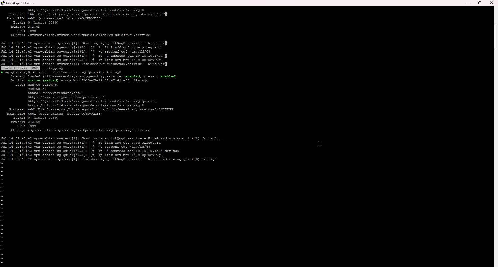

**2. Server configuration file created at /etc/wireguard/wg0.conf**
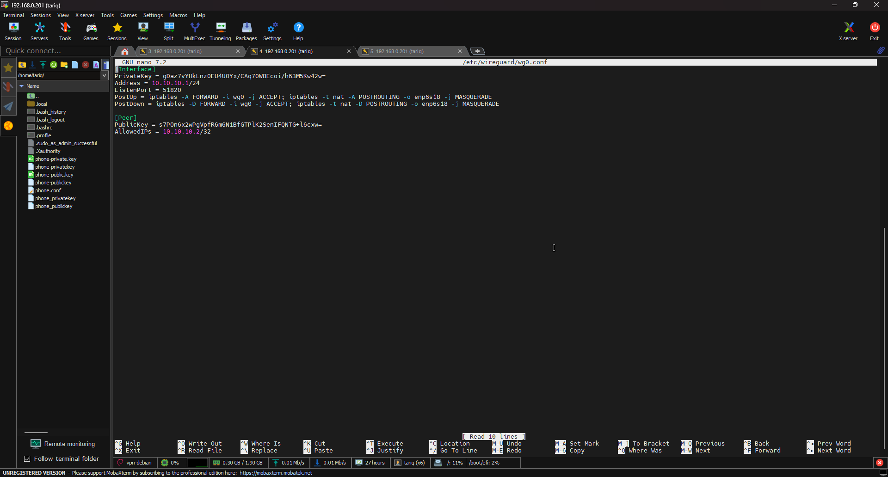

**3. Client (phone) WireGuard config using matching keys and endpoint**
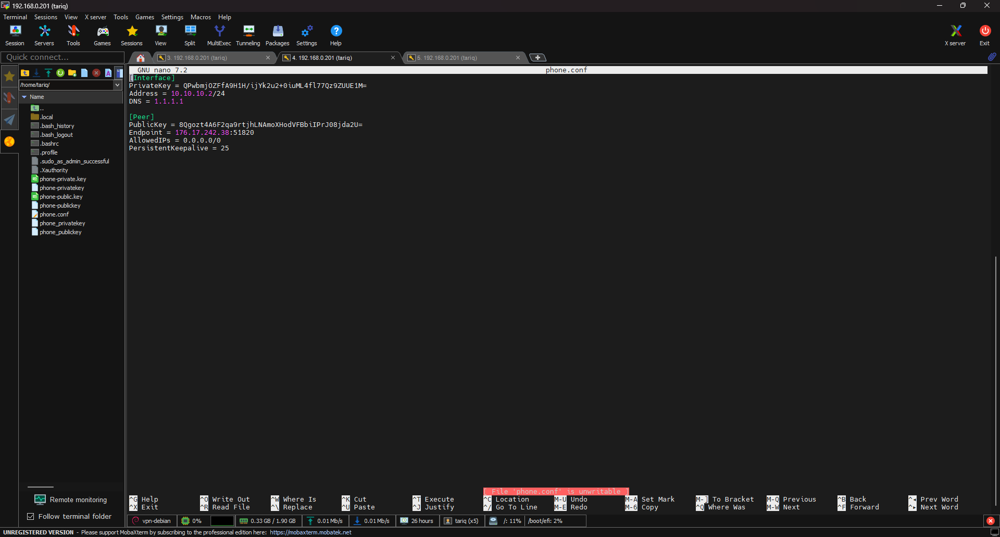

**4. Confirming the correct WireGuard interface settings**
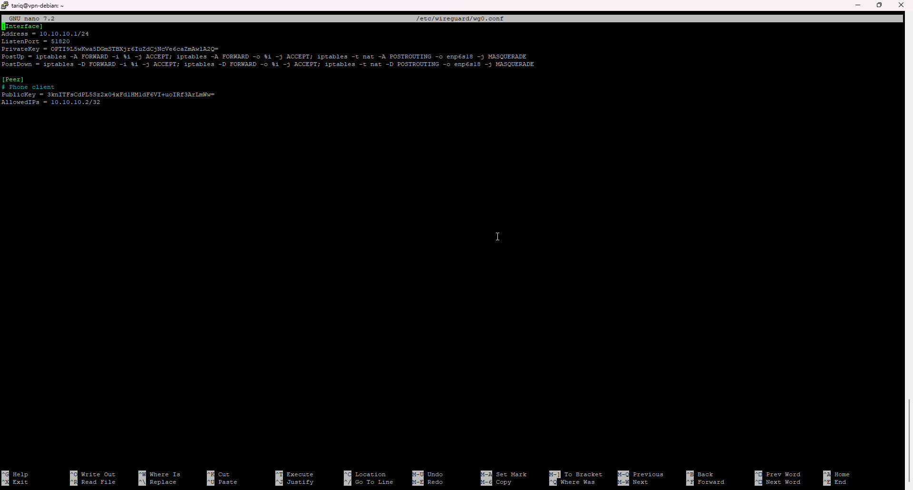

**5. IPTables and DNS routing adjusted for proper forwarding**
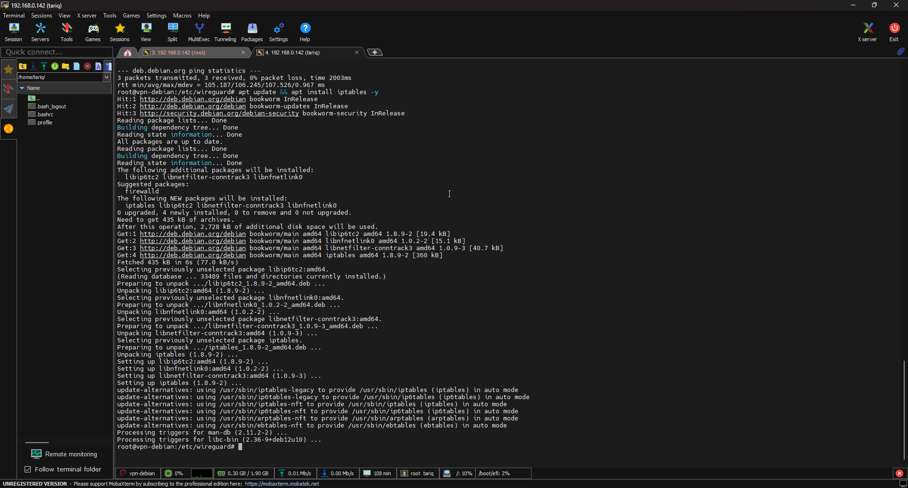

**6. WireGuard interface wg0 is up and has assigned IP**
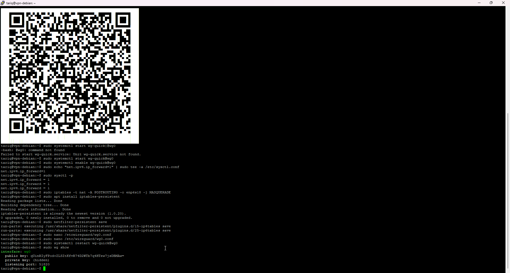

**7. Required services (wg-quick, systemd-resolved) confirmed running**
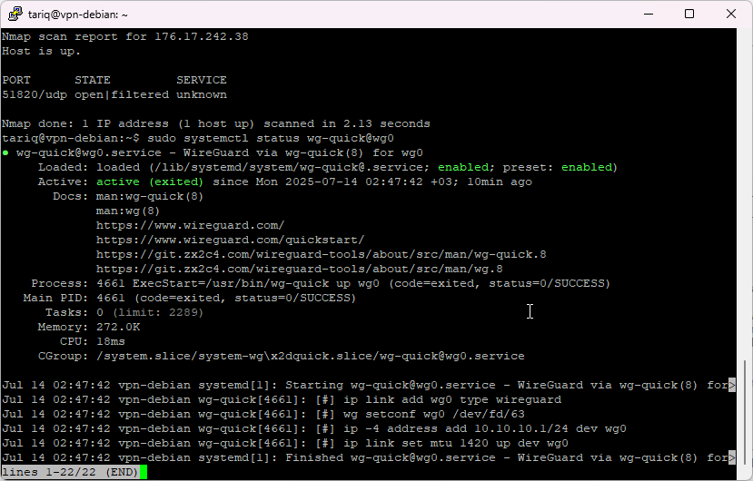

**8. Phone connection settings using mobile data (no Wi-Fi)**
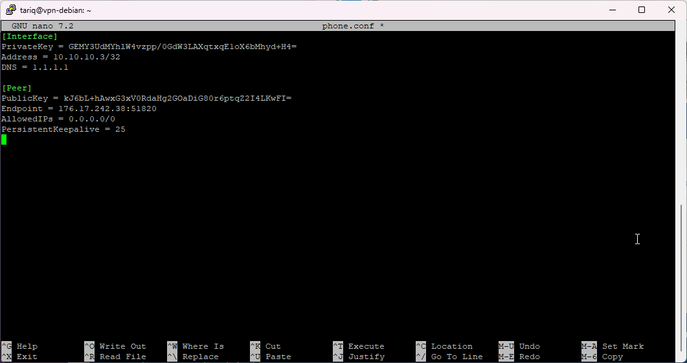

**9. Client unable to ping server – no response over tunnel**
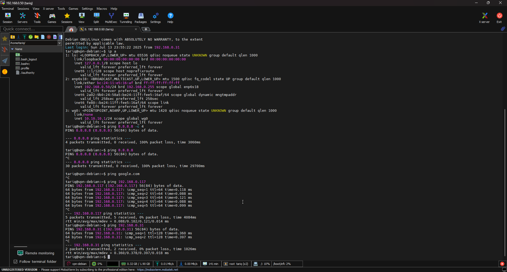

**10. wg-quick up completed successfully with no local errors**
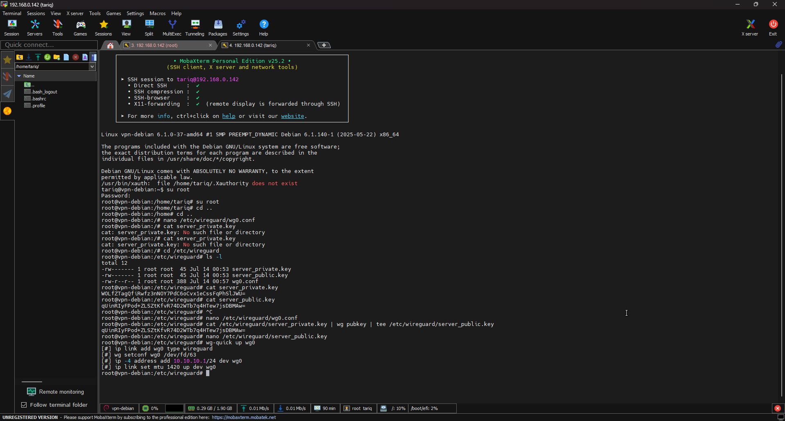

**11. Server public key generated and verified for client pairing**
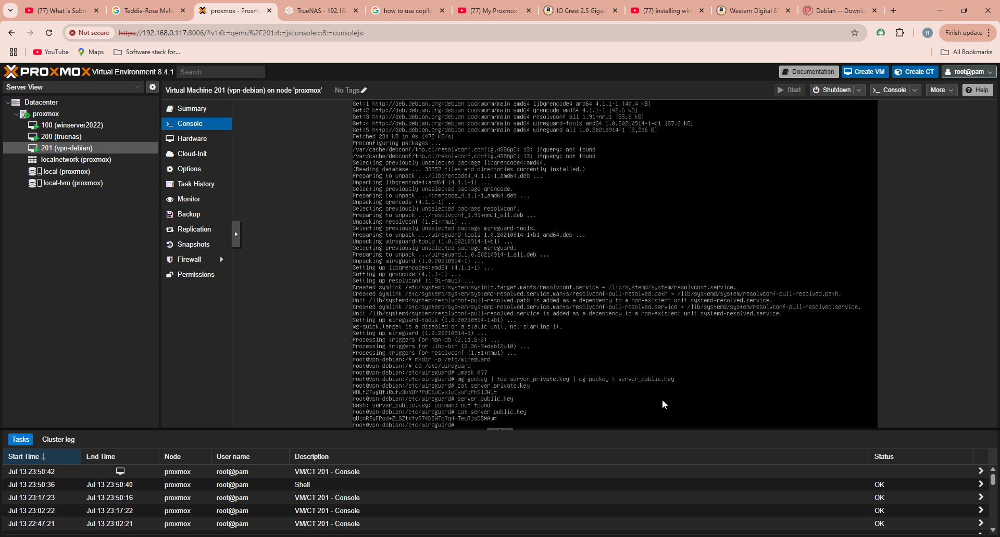

**12. QR code generated from client config for phone import**
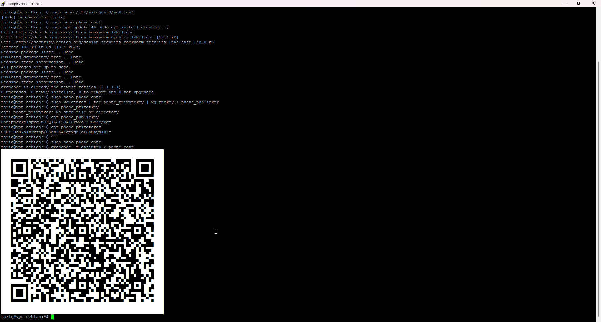

**13. ISP WAN IP reveals CGNAT private address (10.x.x.x)**
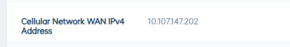

