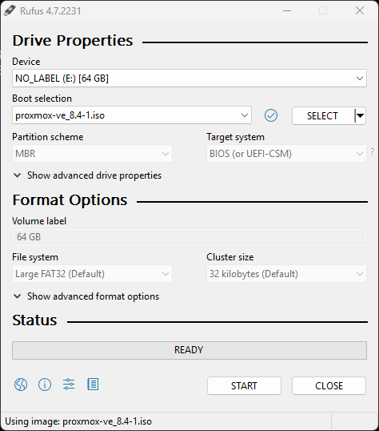

# Project: Installing Proxmox VE 8.4

Proxmox VE installation on bare-metal hardware for homelab virtualization.

---

## 1. ISO Download

Downloaded `proxmox-ve_8.4.iso` from official Proxmox site.  
https://www.proxmox.com/en/downloads/category/iso-images-pve

---

## 2. USB Creation

Flashed ISO to USB using Rufus (MBR, FAT32, ISO mode).

---

## 3. Installation

Booted from USB. Selected disk, set timezone, password, email, and static IP.

---

## 4. First Boot

System booted. Web UI IP displayed.

---

## 5. Repository Fix

Disabled enterprise repo.  
Added `pve-no-subscription` repo.  
Ran full system update.

nano /etc/apt/sources.list.d/pve-enterprise.list
deb http://download.proxmox.com/debian/pve bookworm pve-no-subscription

apt update
apt dist-upgrade

## Result

Clean Proxmox VE 8.4 installation ready for VM and container deployment.
