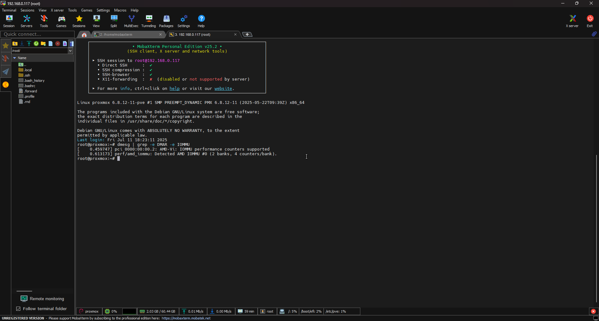
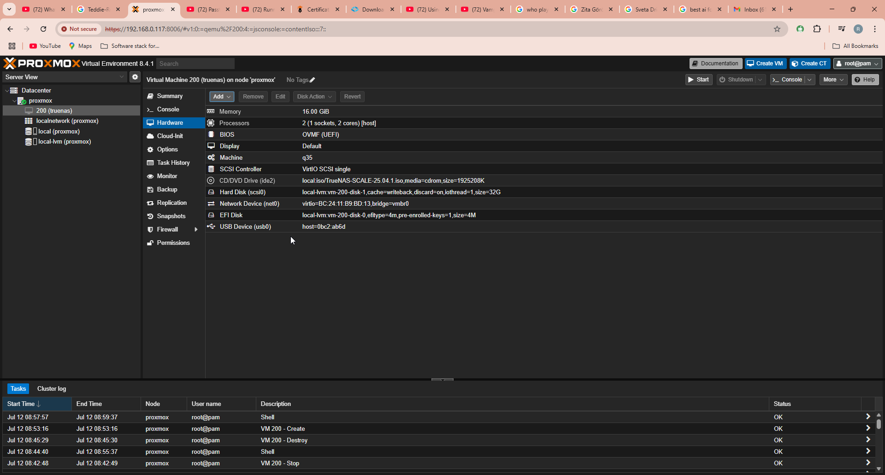
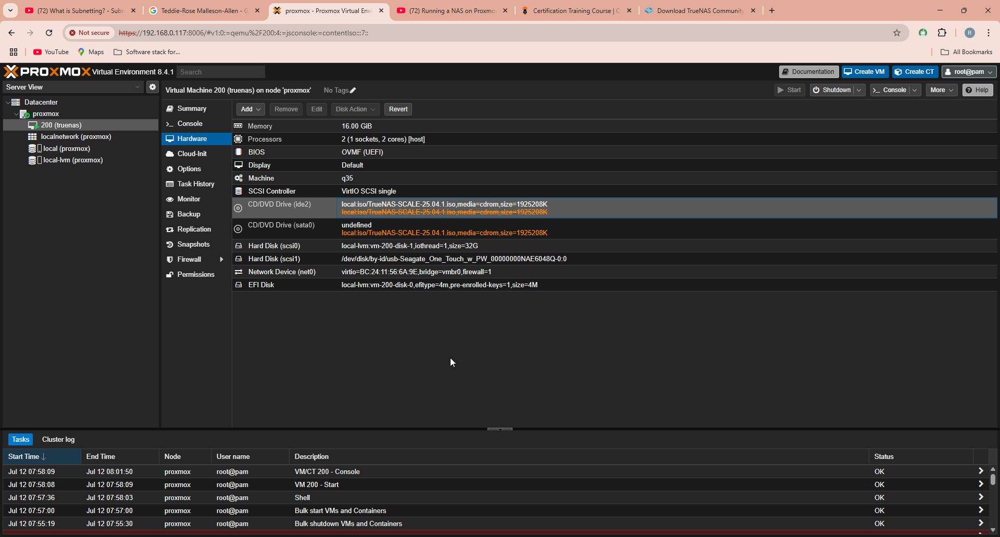
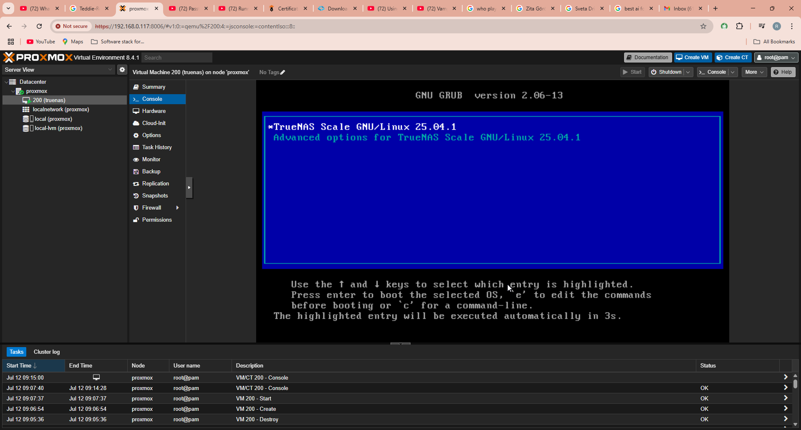
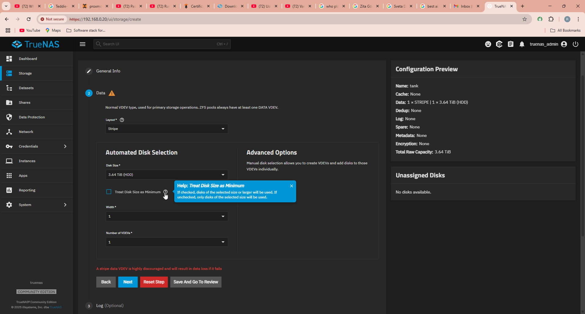
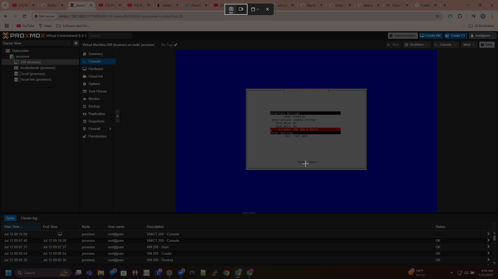
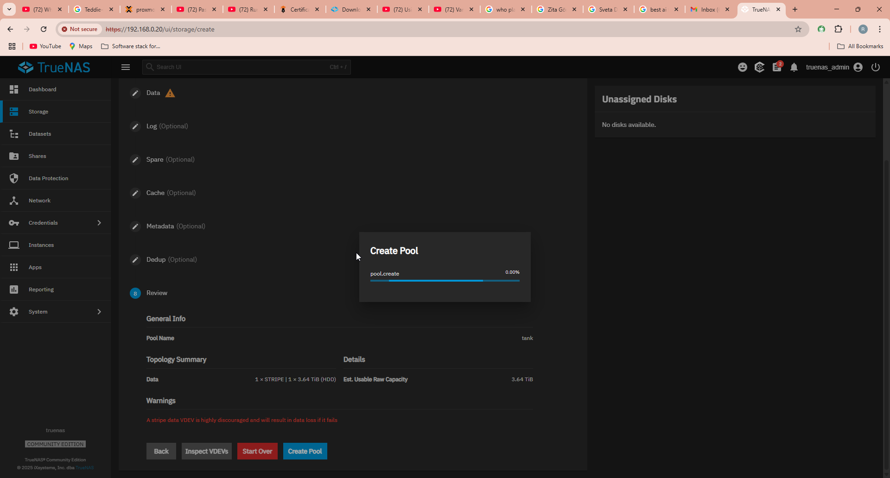
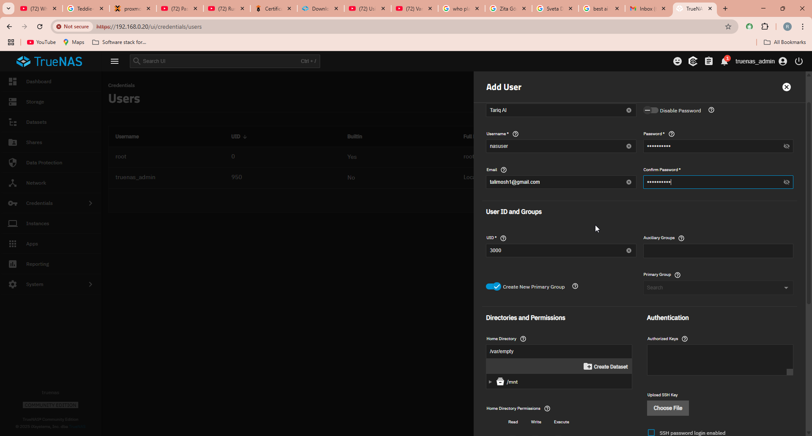
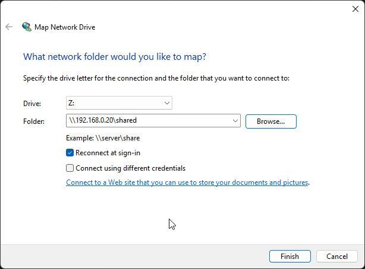

# Project NAS – Part 1: Setup & Storage

This phase of the project focuses on setting up a resilient, LAN-accessible NAS using Proxmox and TrueNAS SCALE in a virtualized homelab.

## Skills Gained

By completing this phase, I gained practical experience in the following areas:

- **Virtualization & Hypervisor Management**  
  Creating and configuring a TrueNAS VM in Proxmox with optimal performance settings.

- **ZFS Storage & Pool Management**  
  Creating a ZFS pool with compression and encryption, understanding VDEVs and datasets.

- **File Sharing (SMB/CIFS)**  
  Setting up user-authenticated SMB shares for reliable file access across the LAN.

- **User Access & Windows Integration**  
  Mapping network drives from Windows to TrueNAS shares with persistent authentication.

---

## Step-by-Step Setup

### 1. Enable IOMMU in BIOS and Proxmox
Ensure that virtualization and IOMMU (SVM/VT-d) are enabled in BIOS. Then, enable IOMMU on the Proxmox host to allow PCI passthrough.  
*(see Pic 1)*

### 2. Add USB Device to Proxmox VM
Attach the external hard drive to the NAS VM by passing through the USB device in Proxmox hardware settings.  
*(see Pic 2)*

### 3. Fix Boot Order if Needed
If TrueNAS fails to boot or stalls, try removing the IDE disk and re-adding it as a SATA disk in Proxmox.  
*(see Pic 3)*

### 4. Boot Into TrueNAS Installer
Launch the TrueNAS SCALE installer from the VM. Select the correct target disk and complete the installation.  
*(see Pic 4)*

### 5. Verify Disks and Select Boot Disk
Once installed, open the TrueNAS dashboard and verify that the boot disk and USB disk are both recognized.  
*(see Pic 5)*

### 5.5 Access TrueNAS Web UI and Configure Network
After reboot, log into the TrueNAS Web UI using the IP shown in the console. Configure static IP, DNS, and hostname to match your LAN plan.  
*(see Pic 6)*

### 6. Create a ZFS Pool
Create a new pool using the USB disk. Choose settings like compression (lz4) and encryption if desired.  
*(see Pic 7)*

### 7. Create a Dataset
Under the pool, create a new dataset to store files. This allows finer-grained control over permissions and sharing.  
*(see Pic 8)*

### 8. Create Local User
Create a local user that will authenticate when connecting to the SMB share from Windows.  
*(see Pic 9)*

### 9. Set Dataset Permissions
Assign the dataset's access rights to the newly created user. Set ownership and access flags properly.  
*(see Pic 10)*

### 10. Map Network Drive in Windows
On a Windows client, use File Explorer to map the network drive. Enter the TrueNAS IP and shared folder path, and authenticate using the local user.  
*(see Pic 11)*

---

## Troubleshooting: Boot Failures with OVMF

During initial setup, the TrueNAS VM failed to boot when using:

- **BIOS:** OVMF (UEFI)  
- **Machine Type:** i440fx (default)

Several attempts with these configurations led to blank screens or failure to reach the installer.

### ✅ Working Configuration (after testing)
- **BIOS:** SeaBIOS  
- **Machine Type:** q35

After switching to SeaBIOS and q35, the VM successfully reached the GRUB screen and booted into the TrueNAS installer. This configuration was used for all subsequent steps in the project.

📌 Notes:
- SeaBIOS provided better compatibility with older bootloaders.
- q35 exposes more modern PCI devices than i440fx and resolved passthrough issues.

---

# TrueNAS VM Setup on Proxmox

This guide documents the installation and configuration of TrueNAS SCALE on a Proxmox virtual machine (VM). It includes enabling virtualization features, disk setup, ZFS pool creation, user management, and network drive mapping. Screenshots are provided for each step to demonstrate the full configuration process.

---

## Screenshots

### Pic 1 – IOMMU Check Enabled in Proxmox BIOS
Enables virtualization passthrough necessary for SATA controller passthrough.

---

### Pic 2 – Added USB Device in Proxmox VM Hardware Tab
Adds the installer USB device to the TrueNAS VM.

---

### Pic 3 – Boot Troubleshoot: Remove IDE, Add SATA
Fixes boot issues by removing the IDE controller and adding a SATA controller.

---

### Pic 4 – GRUB Menu of TrueNAS SCALE
Initial boot screen after successful installation.

---

### Pic 5 – Disk Setup in TrueNAS
Lists the available disks for ZFS pool configuration.

---

### Pic 6 – IP Address Configuration in TrueNAS Web UI
Assigns static IP to the NAS VM inside the web UI.

---

### Pic 7 – Create ZFS Pool
Creates a new ZFS storage pool using the attached disk.

---

### Pic 8 – Dataset Configuration
Defines datasets within the ZFS pool for organizational and access control purposes.

---

### Pic 9 – Local User Creation
Adds a new NAS user to authenticate SMB access.

---

### Pic 10 – Set Dataset Permissions for NAS User
Assigns proper permissions for the created user on the dataset.

---

### Pic 11 – Windows Mapped Network Drive
Maps the NAS share to a Windows drive letter for convenient access.

