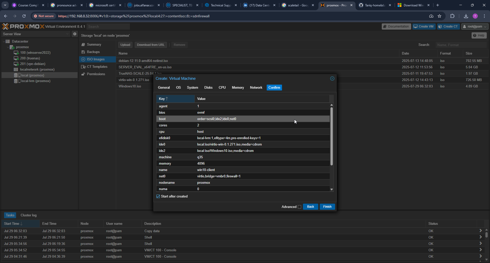
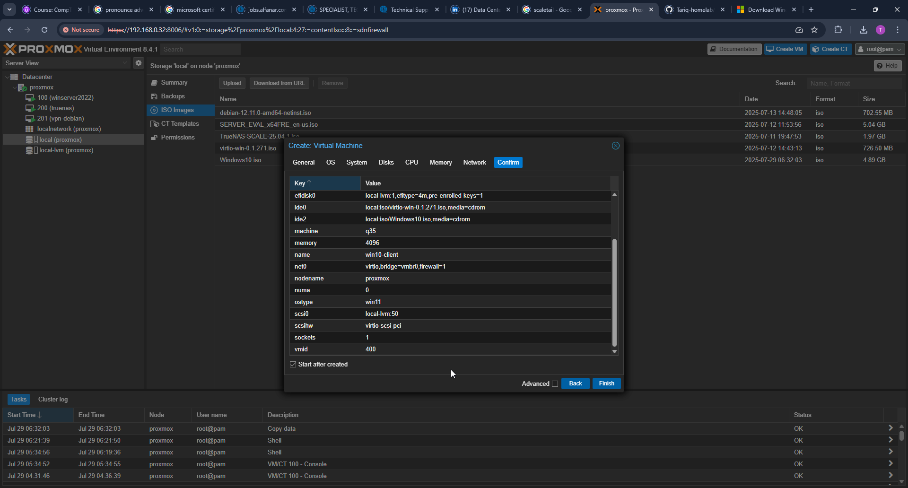
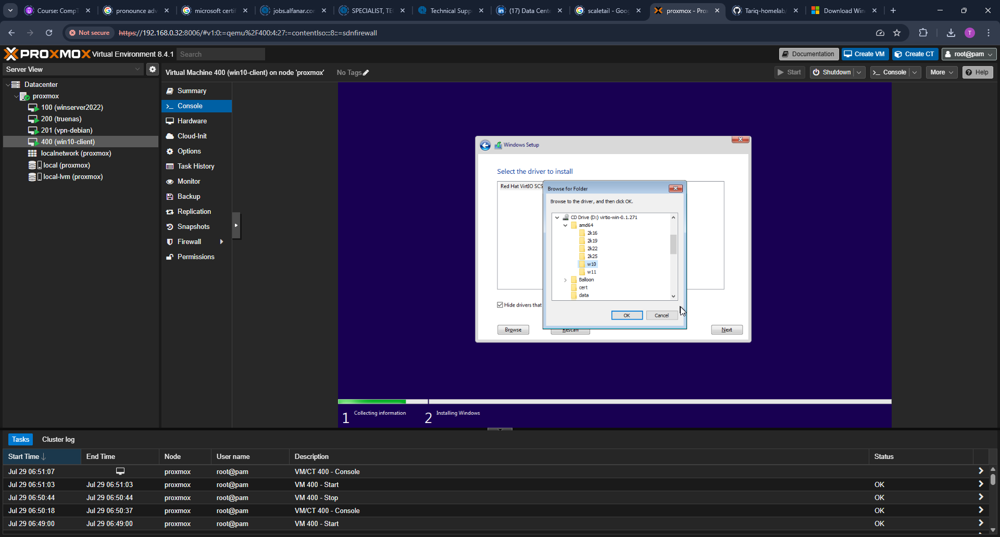

# Windows 10 Client VM – Installation and Network Setup

This VM acts as a domain-joined Windows 10 client within the `homelab.local` Active Directory environment. It is used to test domain login, GPOs, and client-server interactions.

---

## Overview

- Base Image: Windows 10 (ISO)
- Host: Proxmox VE 8.4.1
- VM ID: 400
- IP Address: `192.168.0.40`
- Purpose: Active Directory client, domain-joined workstation

---

## Setup Steps

### 1. Create and Configure the VM in Proxmox

Created a VM in Proxmox using the Windows 10 ISO. Used VM ID `400` to match IP `.40` convention. Attached the VirtIO driver ISO for storage and network driver injection.

---

### 2. Configure VM Hardware

- Set machine type to `q35`
- Added a second CD-ROM for VirtIO drivers
- Assigned 2GB RAM and 2 vCPUs

---

### 3. Load VirtIO Driver During Disk Selection

During Windows setup, the disk was not detected. Resolved by clicking “Load Driver” and browsing to:

## `virtio-win > amd64 > win10`

---

### 4. Troubleshoot Missing Network Adapter

After installation, Windows did not detect a network adapter. Device Manager showed a missing network device.

---

### 5. Install NetKVM (VirtIO Network Driver)

Manually installed the Red Hat VirtIO Ethernet Adapter driver.

## Location: `virtio-win > NetKVM > w10 > amd64`

---

### 6. Confirm Network Connectivity

After driver installation, the network came online and internet access was available.

---

### 7. Configure Static IP

Set a static IP for this client VM to maintain consistent connectivity with the domain controller.

- IP Address: `192.168.0.40`
- Subnet Mask: `255.255.255.0`
- Gateway: `192.168.0.1`
- DNS Server: `192.168.0.32` (the AD Domain Controller)

> The DNS server is set to the Domain Controller (192.168.0.32) so that domain-related lookups (e.g., `homelab.local`) can resolve properly. This is required for domain joining and GPO resolution.

---

## Next Steps

Proceed to join the Windows 10 client to the `homelab.local` domain and test login, policy enforcement, and other AD interactions.
