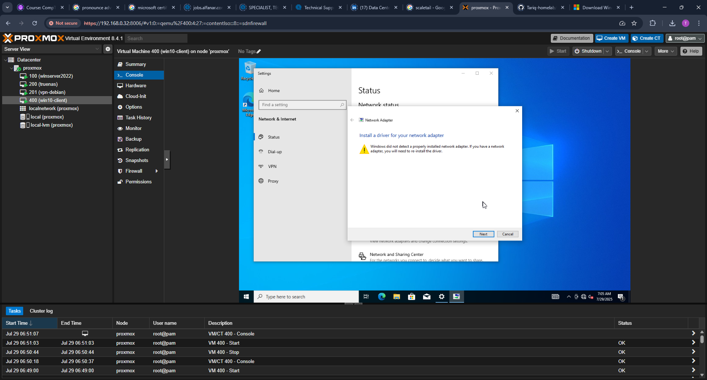
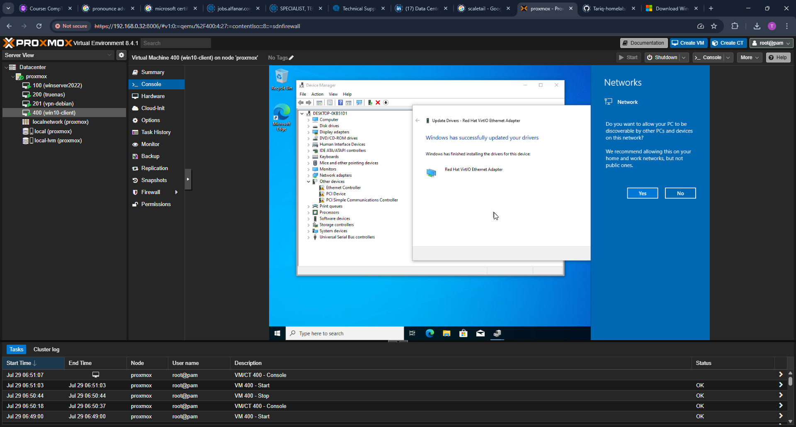

# Windows 10 Client VM Setup

This document outlines the steps taken to create and configure a Windows 10 client VM on Proxmox, intended for use in Active Directory domain testing.

---

## 1. Create the Windows 10 VM in Proxmox

Created a VM in Proxmox with the following specs:

- Name: `win10-client`
- VM ID: `400`
- ISO: Windows 10 (amd64)
- Storage: `local-lvm`
- Disk: 64 GB (VirtIO)
- NIC: VirtIO (paravirtualized)

---

## 2. Load VirtIO Drivers During Installation

Loaded VirtIO drivers from the ISO when prompted for missing disk device during Windows setup.

---

## 3. Complete Windows 10 Installation

Windows 10 was successfully installed with a local administrator account.

---

## 4. Troubleshoot Missing Network Adapter

After installation, Windows did not detect a network adapter. Device Manager showed a missing network device.

---

## 5. Install NetKVM (VirtIO Network Driver)

Manually installed the Red Hat VirtIO Ethernet Adapter driver.

**Location:**  
`virtio-win-0.1.2xx > NetKVM > w10 > amd64`

---

## 6. Confirm Network Connectivity

After driver installation, the network came online and internet access was available.

---

## 7. Configure Static IP

Set a static IP for this client VM to maintain consistent connectivity with the domain controller.

- **IP Address:** `192.168.0.40`
- **Subnet Mask:** `255.255.255.0`
- **Gateway:** `192.168.0.1`
- **DNS Server:** `192.168.0.32` (the AD Domain Controller)

Setting the DNS server to the AD DS host (`192.168.0.32`) ensures correct name resolution for domain services like `homelab.local`.

