# Windows Server 2022 Installation on Proxmox

This document outlines the steps taken to successfully install and configure a Windows Server 2022 virtual machine (VM) on Proxmox VE. It includes ISO uploads, driver integration (VirtIO), system configuration, and guest agent setup. Screenshots are included at the end.

---

## Objective

Deploy a fully functional Windows Server 2022 VM on Proxmox for Active Directory and domain services testing.

---

## Steps

### 1. Upload Installation Media
- Upload both ISOs to Proxmox:
  - `Windows Server 2022 ISO`
  - `virtio-win.iso` (Red Hat VirtIO drivers)

> Datacenter → local storage → Content → Upload

---

### 2. Create the Virtual Machine
- Use the “Create VM” wizard in Proxmox:
  - **Name:** `winserver2022`
  - **OS Tab:** Use "Do not use any media" (ISO will be attached later)
  - **System Tab:**
    - Machine type: `q35`
    - BIOS: `OVMF (UEFI)`
    - Enable TPM and Secure Boot if desired
  - **Hard Disk Tab:**
    - Bus/Device: `VirtIO Block`
    - Disk size: e.g. `64GB`
  - **CPU Tab:** Match host as needed
  - **Memory Tab:** Allocate at least `4GB`
  - **Network Tab:** Model: `VirtIO (paravirtualized)`

---

### 3. Attach ISOs
- Edit VM → Hardware → Add both ISOs:
  - Windows Server ISO (IDE CDROM)
  - `virtio-win.iso` (2nd CDROM)

---

### 4. Start the VM and Begin Installation
- Boot from Windows ISO.
- On disk selection screen, load VirtIO drivers:
  - Choose "Load Driver"
  - Browse to the `virtio-win` ISO → `vioscsi` → `w11` or `amd64`
  - Disk appears — proceed with install

---

### 5. Desktop Experience Selection
- Choose **Windows Server 2022 Standard (Desktop Experience)**.

---

### 6. Post-Install: Load Network Drivers
- From within the VM:
  - Mount the `virtio-win` ISO
  - Install:
    - `NetKVM` → for network interface
    - `QEMU Guest Agent` (optional but recommended)

---

### 7. Enable Enhanced Functionality
- Install:
  - VirtIO drivers for all unknown devices
  - Balloon driver (optional for dynamic memory)
  - QEMU Guest Agent (for Proxmox integration)

---

## Skills Learned

- ISO management in Proxmox
- Configuring VM hardware (UEFI, Q35, VirtIO)
- Loading Red Hat VirtIO drivers during Windows setup
- Installing QEMU Guest Agent for guest-host communication
- Troubleshooting missing devices via Device Manager

---

## Screenshots

1. **Uploading ISO to Proxmox**  
   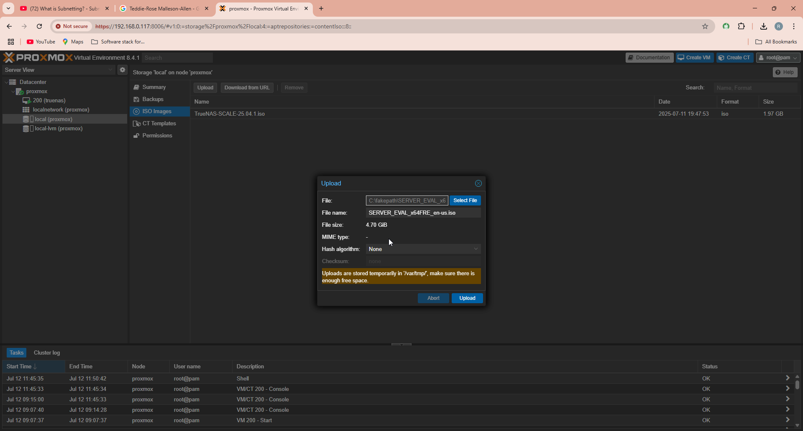

2. **VM creation wizard**  
   

3. **OS settings**  
   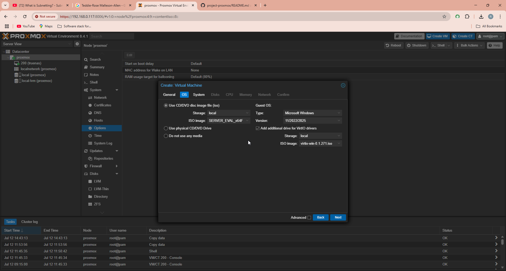

4. **System settings (UEFI + Q35)**  
   

5. **CPU configuration**  
   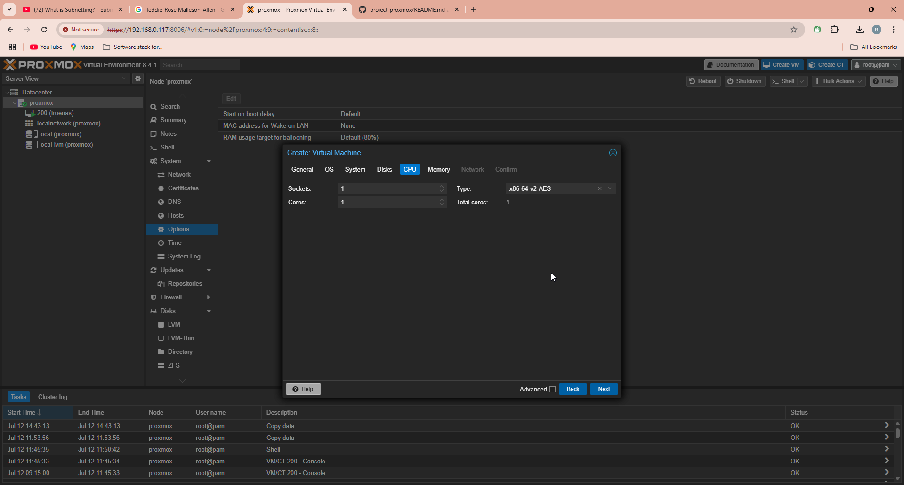

6. **Pre-final confirmation**  
   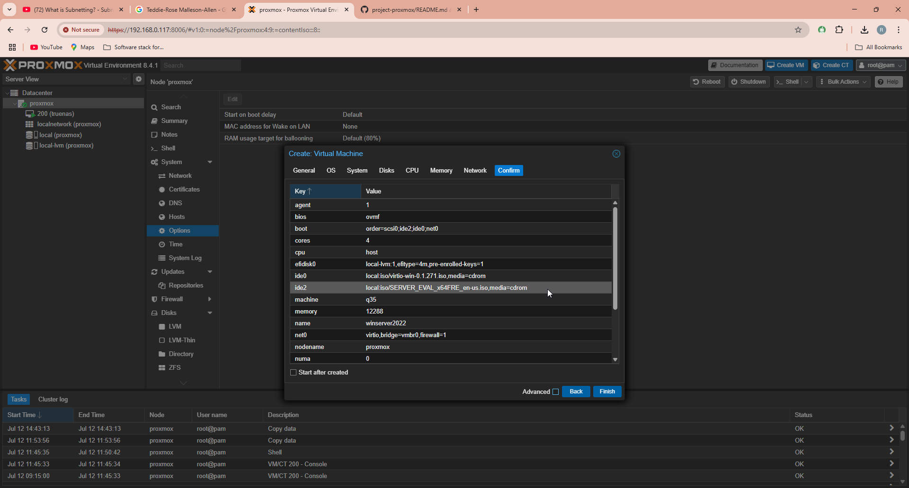

7. **VM summary confirmation**  
   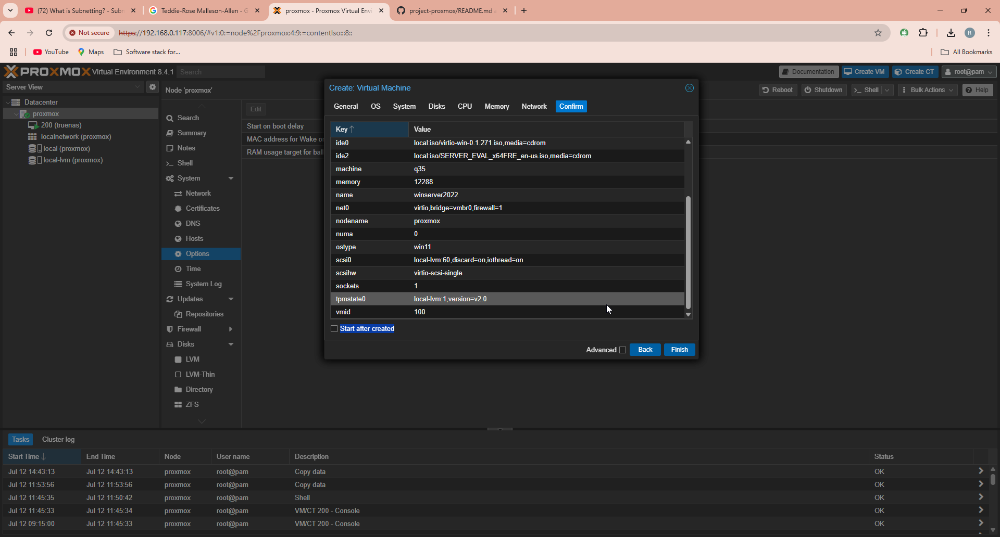

8. **Load driver during Windows setup**  
   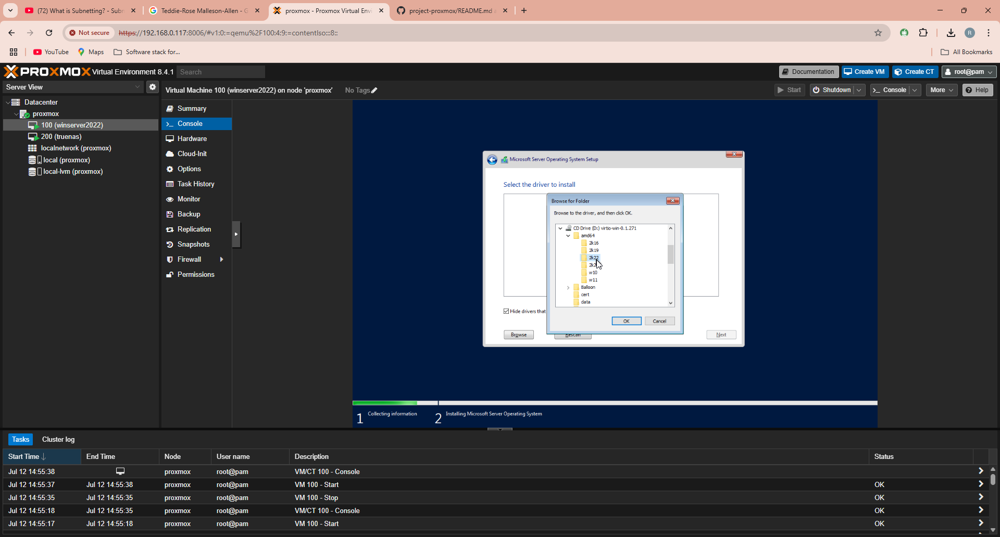

9. **Selecting Red Hat drivers**  
   

10. **Choosing Desktop Experience**  
    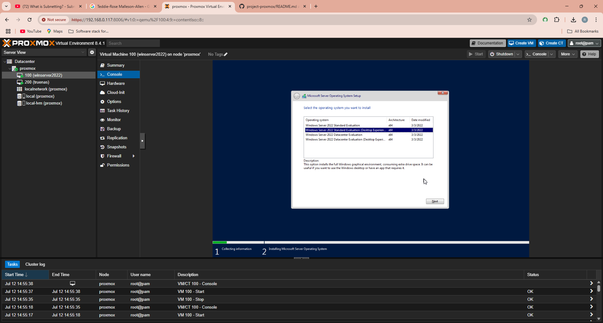

11. **Completing setup**  
    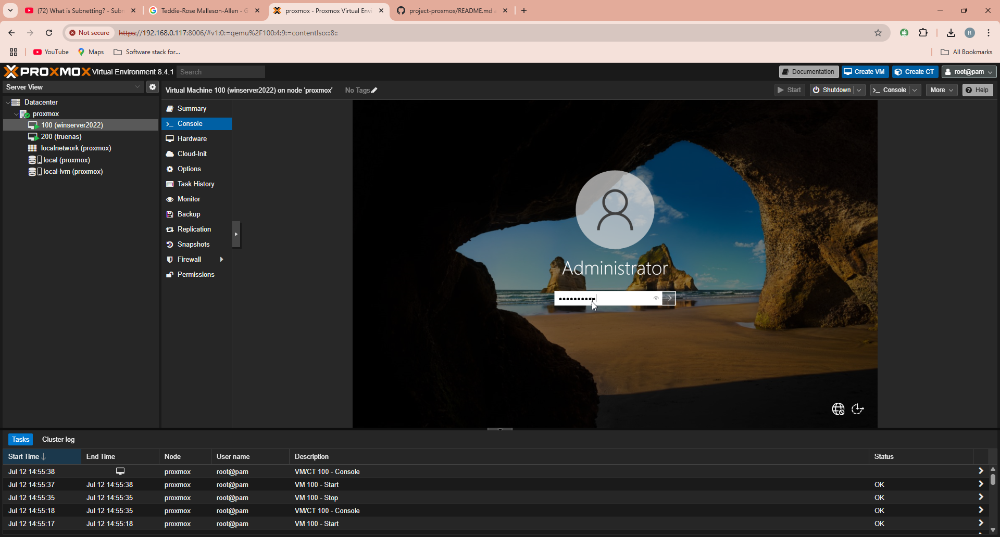

12. **Network driver selection**  
    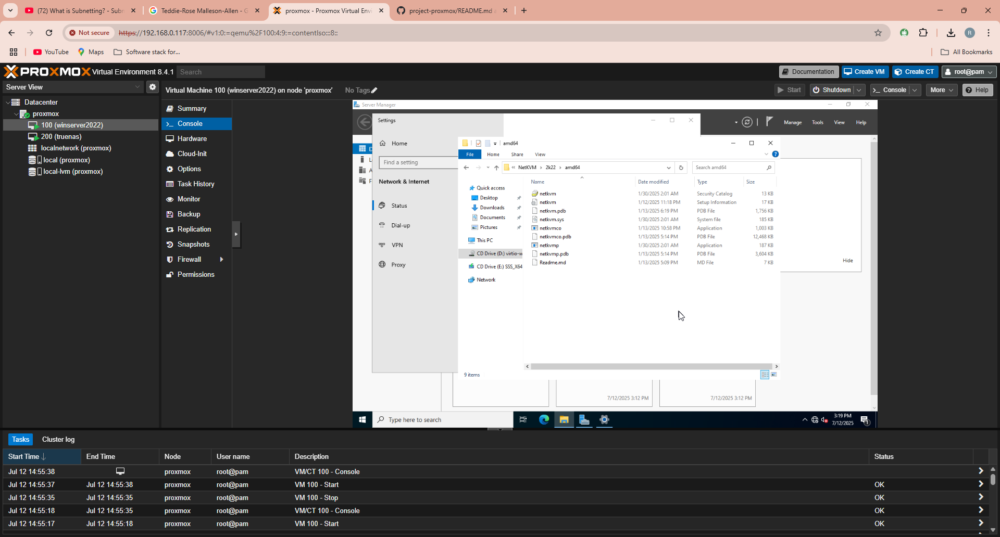

13. **Network driver installation**  
    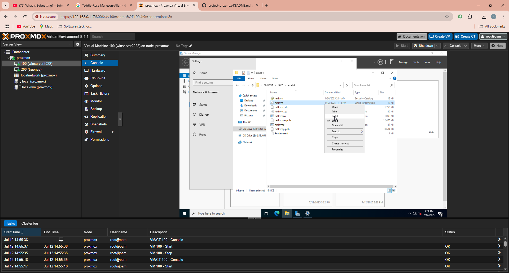

14. **QEMU Guest Agent installer**  
    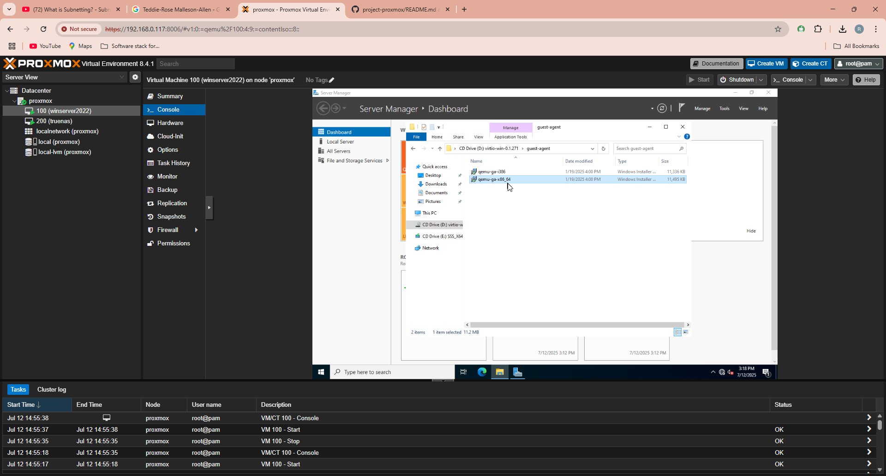

15. **Final desktop view**  
    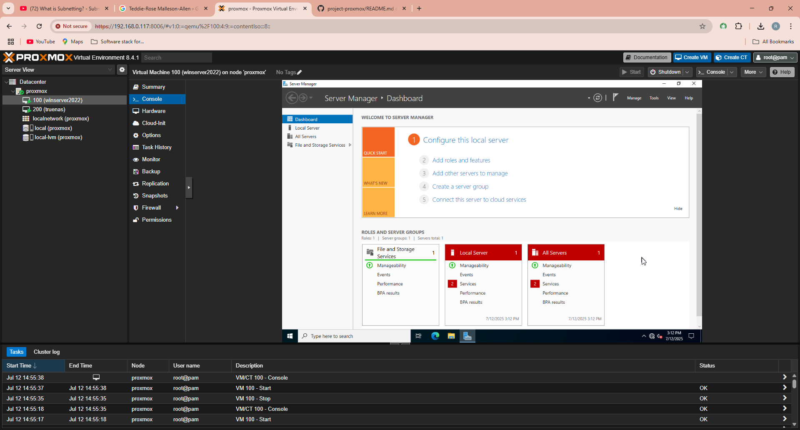

---
